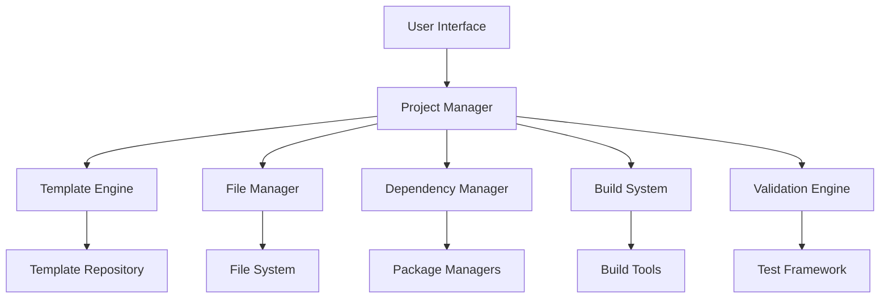

# Design Document

## Overview

The MCP Server Builder is an automated system that creates complete MCP (Model Context Protocol) server environments from scratch. The solution will handle the entire setup process including folder creation, file downloads, dependency management, and build execution to produce a functional MCP server ready for deployment.

Based on research of the MCP ecosystem, the system will support multiple server types and frameworks including Python SDK, TypeScript SDK, and various community implementations. The builder will provide templates for common server patterns and allow customization for specific use cases.

## Architecture

The system follows a modular architecture with clear separation of concerns:



### Core Components

1. **Project Manager**: Orchestrates the entire build process and manages project state
2. **Template Engine**: Handles server template selection and customization
3. **File Manager**: Manages file downloads, placement, and permissions
4. **Dependency Manager**: Handles package installation and environment setup
5. **Build System**: Executes build commands and manages compilation
6. **Validation Engine**: Tests and validates the completed server setup

## Components and Interfaces

### Project Manager Interface
```python
class ProjectManager:
    def create_project(self, name: str, template: str, config: dict) -> ProjectResult
    def get_project_status(self, project_id: str) -> ProjectStatus
    def cleanup_project(self, project_id: str) -> bool
```

### Template Engine Interface
```python
class TemplateEngine:
    def list_templates(self) -> List[ServerTemplate]
    def get_template(self, template_id: str) -> ServerTemplate
    def apply_template(self, template: ServerTemplate, config: dict) -> TemplateResult
```

### File Manager Interface
```python
class FileManager:
    def create_directory_structure(self, path: str, structure: dict) -> bool
    def download_files(self, files: List[FileSpec]) -> DownloadResult
    def set_permissions(self, path: str, permissions: str) -> bool
```

### Dependency Manager Interface
```python
class DependencyManager:
    def detect_package_manager(self, project_path: str) -> PackageManager
    def install_dependencies(self, project_path: str, dependencies: List[str]) -> InstallResult
    def verify_installation(self, project_path: str) -> VerificationResult
```

### Build System Interface
```python
class BuildSystem:
    def detect_build_system(self, project_path: str) -> BuildTool
    def execute_build(self, project_path: str, commands: List[str]) -> BuildResult
    def get_build_artifacts(self, project_path: str) -> List[str]
```

## Data Models

### Server Template
```python
@dataclass
class ServerTemplate:
    id: str
    name: str
    description: str
    language: str  # python, typescript, go, etc.
    framework: str  # fastmcp, low-level, etc.
    files: List[TemplateFile]
    dependencies: List[str]
    build_commands: List[str]
    configuration_schema: dict
```

### Project Configuration
```python
@dataclass
class ProjectConfig:
    name: str
    template_id: str
    output_directory: str
    custom_settings: dict
    environment_variables: dict
    additional_dependencies: List[str]
```

### Build Result
```python
@dataclass
class BuildResult:
    success: bool
    project_path: str
    artifacts: List[str]
    logs: List[str]
    errors: List[str]
    execution_time: float
```

## Error Handling

The system implements comprehensive error handling with specific error types:

### Error Categories
1. **Template Errors**: Invalid template selection, missing template files
2. **File System Errors**: Permission issues, disk space, network failures
3. **Dependency Errors**: Package not found, version conflicts, installation failures
4. **Build Errors**: Compilation failures, missing tools, configuration issues
5. **Validation Errors**: Server startup failures, protocol compliance issues

### Error Recovery Strategies
- **Retry Logic**: Automatic retry for transient network and file system errors
- **Fallback Templates**: Alternative templates when primary selection fails
- **Partial Recovery**: Continue with available components when non-critical parts fail
- **Rollback Capability**: Clean removal of partially created projects

## Testing Strategy

### Unit Testing
- Individual component testing with mocked dependencies
- Template engine validation with various configurations
- File manager operations with different file systems
- Dependency manager testing with multiple package managers

### Integration Testing
- End-to-end project creation workflows
- Cross-platform compatibility testing (Windows, macOS, Linux)
- Multiple MCP server framework testing
- Network failure and recovery scenarios

### Validation Testing
- Generated server functionality verification
- MCP protocol compliance testing
- Performance benchmarking of build processes
- Security validation of file operations

### Test Data
- Sample templates for major MCP frameworks
- Mock file repositories for download testing
- Simulated network conditions for resilience testing
- Various project configurations for edge case testing

## Supported Server Types

Based on MCP ecosystem research, the system will support:

### Python Servers
- **FastMCP Framework**: High-level Python framework with decorators
- **Low-level SDK**: Direct MCP protocol implementation
- **Template Examples**: Simple tool server, resource server, prompt server

### TypeScript Servers
- **Official TypeScript SDK**: Standard MCP TypeScript implementation
- **Framework Integrations**: Next.js, Starlette mounting
- **Transport Options**: STDIO, SSE, Streamable HTTP

### Community Frameworks
- **Go Servers**: Foxy Contexts library
- **Rust Servers**: Production-ready implementations
- **Java Servers**: Quarkus and declarative SDKs

## Configuration Management

### Template Configuration
Templates include configuration schemas that define:
- Required parameters (server name, description)
- Optional settings (transport type, authentication)
- Environment variables
- Custom tool/resource definitions

### Build Configuration
Build processes are configured through:
- Package manager detection (npm, pip, cargo, etc.)
- Build tool selection (webpack, tsc, cargo build)
- Output directory structure
- Artifact generation rules

### Runtime Configuration
Generated servers include:
- MCP server metadata (name, version, capabilities)
- Transport configuration (STDIO, HTTP, SSE)
- Authentication settings (OAuth, API keys)
- Logging and debugging options